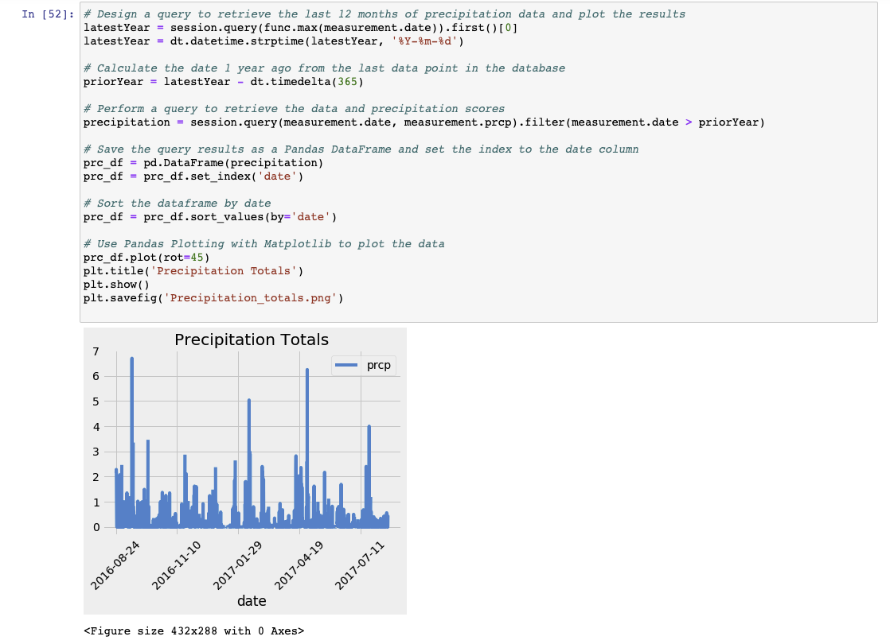
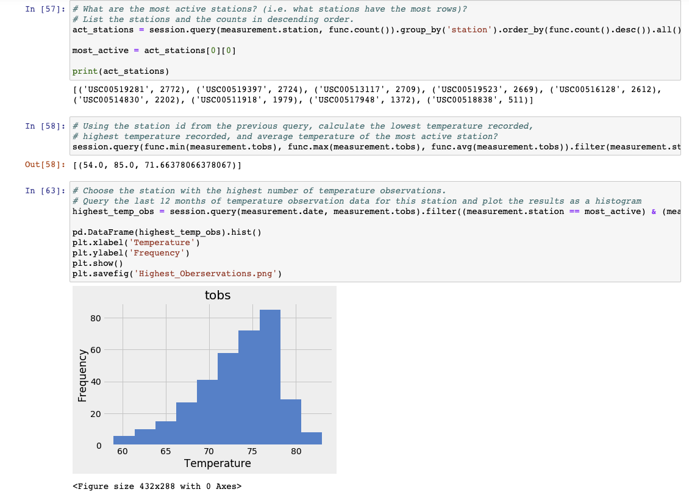

## Surfs Up!

With a vacation long over due, we have decided to plan a long holiday vacation in Honolulu, Hawaii! To help with our trip planning, we've created a Python script with Pandas, Matplotlib and SQLAlchemy to find the ideal weather conditions.

### Precipitation Analysis

In our Python script we want to retrieve information like, the last 12 months of precipitaion data: 

### Station Analysis

Here we have our sqlAlchemy queries to calculate the total number of stations, the most active stations
and the last 12 months of temperature observations:

- - -

